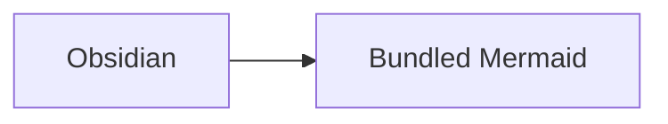

# Obsidian Patch

Obsidian Patch is an Obsidian plugin that collects focused compatibility fixes
and enhancements in one place. Each patch is implemented as an independent
feature so the plugin can grow without coupling unrelated behavior.

The first feature renders `mermaid-latest` code blocks with a bundled Mermaid
release. It works offline, loads no code from remote CDNs, and does not replace
Obsidian's built-in `mermaid` processor.

## Features

### Bundled Mermaid

- Renders the dedicated `mermaid-latest` fenced code block.
- Bundles Mermaid `11.16.0` with the plugin for reliable offline use.
- Bundles the Material Icon Theme and SVG Logos packs for Mermaid diagrams that support icons.
- Offers Strict, Sandbox, and Loose Mermaid security modes.
- Keeps Obsidian's built-in `mermaid` code block unchanged.
- Displays rendering errors directly below invalid diagrams.

## Installation

Copy the release files into the following directory in your vault:

```text
<vault>/.obsidian/plugins/obsidian-patch/
```

Required files:

- `main.js`
- `manifest.json`
- `styles.css`

Reload Obsidian, open **Settings > Community plugins**, and enable
**Obsidian Patch**.

> [!NOTE]
> The previous plugin ID was `mermaid-patch`. Obsidian treats
> `obsidian-patch` as a different plugin, so an existing installation must be
> moved to the new directory and enabled again.

## Usage

Use `mermaid-latest` instead of `mermaid` when you want the renderer bundled
with this plugin:

````markdown

````

The separate language name intentionally avoids competing with Obsidian's
built-in Markdown code-block processor.

### Security Mode

Choose a Mermaid security level under **Settings > Obsidian Patch**. New
installations default to Strict.

| Mode | Behavior |
| --- | --- |
| Strict | Sanitizes SVG before inserting it into Obsidian. Mermaid 11.16 currently removes the SVG references used by treeView icons. |
| Sandbox | Renders inside an isolated iframe. TreeView icons work, but links and other interactive behavior may be limited. |
| Loose | Inserts unsanitized Mermaid output directly into Obsidian. Icons and interactions work, but this mode must only be used with fully trusted diagram content. |

Sandbox is the recommended mode when a diagram needs icons. Loose mode can
expose Obsidian to malicious HTML or SVG from copied, imported, synchronized,
or automatically generated notes. Reading View refreshes when the setting
changes; reopen Live Preview notes or switch view modes to refresh their
existing diagrams.

### TreeView Icons

Set the security mode to Sandbox or Loose before using treeView icons. Strict
mode removes the icon references from Mermaid's rendered SVG.

The bundled `material-icon-theme` pack can be referenced explicitly with
`icon(material-icon-theme:<name>)`:

````markdown

````

The bundled [SVG Logos](https://icon-sets.iconify.design/logos/) pack uses the
`logos` prefix and is available under the CC0 license. Explicit prefixes let
both packs be used in the same diagram:

````markdown

````

You can also configure a default pack and file-type mappings in Mermaid
frontmatter. The plugin does not apply mappings globally, so each diagram
controls its own icon behavior:

````markdown

````

## Development

Requirements:

- Node.js 22 or later
- npm

Install dependencies and create a production build:

```bash
npm install
npm run build
```

Start esbuild in watch mode during development:

```bash
npm run dev
```

The production build performs TypeScript type checking and writes the bundled
plugin to `main.js`.

## Project Structure

```text
.
|-- .github/
|   |-- dependabot.yml
|   `-- workflows/
|       `-- build.yml
|-- src/
|   |-- features/
|   |   `-- mermaid-latest.ts
|   `-- main.ts
|-- .gitignore
|-- esbuild.config.mjs
|-- LICENSE
|-- main.js
|-- manifest.json
|-- package-lock.json
|-- package.json
|-- README.md
|-- styles.css
|-- tsconfig.json
`-- versions.json
```

### Directories

| Path | Purpose |
| --- | --- |
| `.github/` | GitHub automation and repository maintenance configuration. |
| `.github/workflows/` | GitHub Actions workflows used to validate changes. |
| `src/` | Readable TypeScript source code for the plugin. |
| `src/features/` | Independent patch and enhancement modules registered by the plugin entry point. |
| `node_modules/` | Locally installed npm dependencies. This directory is generated and excluded from version control. |

### Files

| Path | Purpose |
| --- | --- |
| `.github/dependabot.yml` | Checks npm dependencies daily and opens update pull requests when new releases are available. |
| `.github/workflows/build.yml` | Installs locked dependencies and runs the production build for pushes and pull requests. |
| `src/main.ts` | Obsidian plugin entry point. It manages the plugin lifecycle and registers each feature. |
| `src/features/mermaid-latest.ts` | Initializes the bundled Mermaid library, registers `mermaid-latest`, renders SVG output, and reports errors. |
| `.gitignore` | Excludes dependencies, generated bundles, source maps, and local operating-system files. |
| `esbuild.config.mjs` | Bundles the TypeScript entry point and runtime dependencies into Obsidian's CommonJS `main.js` format. |
| `LICENSE` | MIT license terms for the project. |
| `main.js` | Generated plugin bundle loaded by Obsidian. Build this file from source instead of editing it manually. |
| `manifest.json` | Obsidian plugin metadata, including the plugin ID, display name, version, and minimum supported app version. |
| `package-lock.json` | Records the exact npm dependency graph for reproducible installs and CI builds. |
| `package.json` | Defines project metadata, scripts, runtime dependencies, and development dependencies. |
| `README.md` | Project overview, installation instructions, usage, development notes, and maintenance policy. |
| `styles.css` | Styles Mermaid output, responsive overflow behavior, and rendering errors. |
| `tsconfig.json` | Strict TypeScript compiler and type-checking configuration. |
| `versions.json` | Maps each plugin release to its minimum supported Obsidian version. |

## Adding a Feature

Place each new patch in a focused module under `src/features/`, export a small
registration function, and call that function from `src/main.ts`. Keep shared
infrastructure minimal until more than one feature has a concrete need for it.

Feature-specific selectors and generated IDs should use the
`obsidian-patch-<feature>` namespace to avoid collisions with Obsidian and
other plugins.

## Keeping Mermaid Current

Mermaid is pinned to an exact version and bundled at build time. The plugin
does not load JavaScript from a CDN because browser caches are not a reliable
offline guarantee and runtime remote code weakens security and reproducibility.

Dependabot checks npm dependencies daily. When Mermaid publishes a release,
it opens a pull request that updates the dependency lock. GitHub Actions then
type-checks and builds the plugin. Mermaid updates should be reviewed and
tested before merging because even semver-compatible releases can change
diagram output.

This approach keeps the bundled renderer current through tested plugin
releases rather than changing installed behavior without notice.

## Author and Acknowledgements

- Author: yaroxy
- Email: yaroxywithyou@gmail.com
- AI collaboration: GPT-5.6-Sol
- Development environment: OpenCode

## License

Released under the [MIT License](LICENSE).
