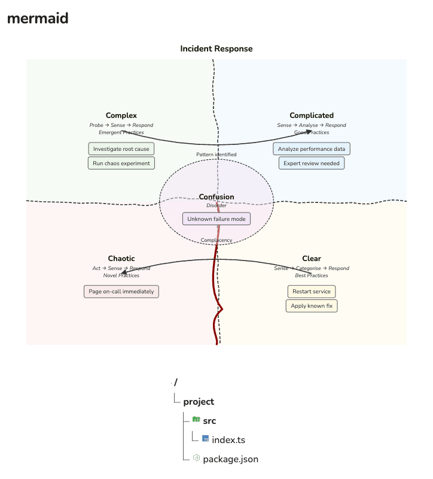
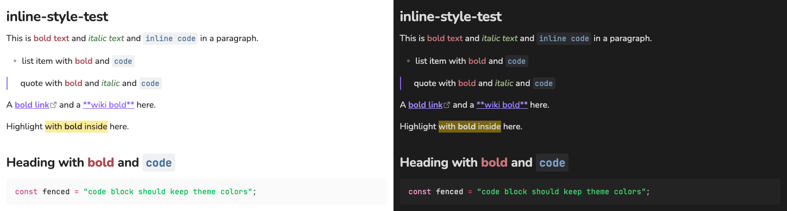
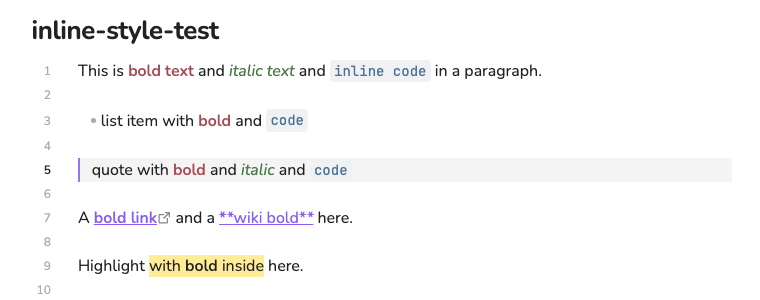
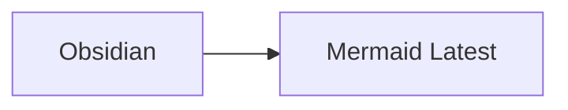

# Obsidian Patch

Obsidian Patch is an Obsidian plugin that collects focused compatibility fixes and enhancements in one place. Each patch is an independent feature, so the plugin can grow without coupling unrelated behavior.

- **Mermaid Latest** renders `mermaid-latest` code blocks with the newest Mermaid release, loaded from jsDelivr, and falls back to a bundled copy offline. Diagrams follow Obsidian's text font and light or dark theme.
- **Inline Styles** colorizes bold, italic, and inline code with muted presets.
- **Active Line** tints the line the cursor is on.

|                      | Version                                     |
| -------------------- | ------------------------------------------- |
| Plugin               | 0.1.0                                       |
| Tested with Obsidian | 1.13.7 (desktop)                            |
| Obsidian API typings | 1.13.1                                      |
| Bundled Mermaid      | 12.1.0, with `@mermaid-js/layout-elk` 1.0.1 |

## Screenshots

Mermaid diagrams re-render with Obsidian's theme and font:



Inline styles in light and dark themes:



The active line in Live Preview:



## Quick Start

1. Build the plugin. This requires Node.js 22 or later and npm:

```bash
npm install
npm run build
```

The build type-checks the source and writes `main.js`. During development, `npm run dev` rebuilds on every change.

2. Copy `main.js`, `manifest.json`, and `styles.css` into the plugin directory of your vault:

```text
<vault>/.obsidian/plugins/obsidian-patch/
```

3. Reload Obsidian, open **Settings > Community plugins**, and enable **Obsidian Patch**.

4. Write a `mermaid-latest` code block. The built-in `mermaid` block is left unchanged, so both renderers can be used side by side:

````markdown

````

> [!NOTE]
> The previous plugin ID was `mermaid-patch`. Obsidian treats `obsidian-patch` as a different plugin, so an existing installation must be moved to the new directory and enabled again.

## Project Structure

```text
.
├── .github/
│   ├── dependabot.yml           Daily npm update pull requests
│   └── workflows/build.yml      Type-check and build on pushes and pull requests
├── docs/images/                 Screenshots used by this README
├── src/
│   ├── features/                One independent module per patch
│   │   ├── active-line.ts
│   │   ├── inline-styles.ts
│   │   ├── mermaid-latest.ts    Code block processor, theming, re-rendering
│   │   └── mermaid-runtime.ts   Loads Mermaid from jsDelivr or the bundle
│   ├── build.d.ts               Types for values the build injects
│   └── main.ts                  Plugin entry point, settings, and settings tab
├── CHANGELOG.md
├── esbuild.config.mjs           Bundles src/ into Obsidian's CommonJS main.js
├── manifest.json                Plugin ID, version, and minimum app version
├── styles.css                   All plugin styles and their custom properties
└── versions.json                Minimum Obsidian version for each release
```

`main.js` is generated by the build and should never be edited by hand.

To add a feature, place it in a focused module under `src/features/`, export a small registration function, and call it from `src/main.ts`. Selectors and generated IDs use the `obsidian-patch-<feature>` namespace, and user-visible changes go under `Unreleased` in [CHANGELOG.md](CHANGELOG.md).

## Settings

All settings live under **Settings > Obsidian Patch** and apply immediately. Open diagrams re-render in Reading View and Live Preview alike.

### Mermaid Version

| Option           | Source                                                              | Network  |
| ---------------- | ------------------------------------------------------------------- | -------- |
| Latest (default) | The newest Mermaid release, resolved to an exact version on startup | Required |
| Bundled          | The copy shipped inside `main.js`                                   | None     |
| Custom           | An exact release typed in, such as `12.0.0`, from 11.0.0 on         | Required |

Choosing Custom reveals a version field. The version applies when the field loses focus or on Enter, and an invalid entry is outlined instead of applied. The setting shows the version in use and where it came from.

- **Latest** asks jsDelivr which version `latest` points to, then loads that exact version. The plugin remembers the result, so an offline startup can still use the browser's cached copy.
- **Fallback.** When a remote version cannot be loaded, diagrams render with the bundled copy and the setting shows why.
- **ELK layouts** load alongside Mermaid, in the `@mermaid-js/layout-elk` release line that matches its major version.
- **Trust.** Remote versions run with full access to Obsidian, like any plugin code. They come from npm through jsDelivr without an integrity check, because `latest` changes with every release. Choose Bundled to run only the code shipped with the plugin. The bundled copy is pinned to an exact version, verified through `package-lock.json`, and updated through reviewed Dependabot pull requests.

### Mermaid Security Level

| Level            | Behavior                                                                                                                                                     |
| ---------------- | ------------------------------------------------------------------------------------------------------------------------------------------------------------ |
| Strict (default) | Sanitizes SVG before inserting it into Obsidian. Mermaid currently removes the SVG references used by treeView icons.                                        |
| Loose            | Inserts unsanitized Mermaid output directly into Obsidian. Icons and interactions work, but this level must only be used with fully trusted diagram content. |

Loose mode can expose Obsidian to malicious HTML or SVG from copied, imported, synchronized, or automatically generated notes.

TreeView icons require Loose. Two icon packs are bundled: `material-icon-theme` and [SVG Logos](https://icon-sets.iconify.design/logos/) (`logos`, CC0). Both are embedded gzip-compressed and decompressed the first time a diagram needs them:

````markdown

````

A default pack and file-type mappings can be set per diagram in frontmatter:

````markdown

````

### Mermaid Appearance

There is no font or theme setting. Diagrams use the `--font-mermaid` custom property, the same one as Obsidian's built-in renderer, which defaults to the note's text font. Light themes use Mermaid's `default` theme and dark themes its `dark` theme. A CSS snippet can give diagrams their own font:

```css
body {
  --font-mermaid: "Inter", sans-serif;
}
```

### Inline Styles

One toggle each for **Bold** (red), **Italic** (green), and **Inline code** (blue on gray). All are on by default.

The feature redefines Obsidian's own typography properties (`--bold-color`, `--italic-color`, `--code-normal`, `--code-background`) on note content only, so Reading View and Live Preview stay consistent, themes keep control of spacing and borders, and the app interface is unaffected. Fenced code blocks keep the theme's colors. Bold and italic keep the surrounding color inside links and highlights, and are colorized inside blockquotes.

The presets sit near Nord's Aurora and Frost hues at 24-47% saturation, and every color clears a 4.5:1 contrast ratio against its background:

| Style                  | Light     | Dark      |
| ---------------------- | --------- | --------- |
| Bold                   | `#a54d54` | `#c9757c` |
| Italic                 | `#487a45` | `#a3be8c` |
| Inline code            | `#4c6f96` | `#81a1c1` |
| Inline code background | `#f0f1f3` | `#2a2b2e` |

Override any color from a CSS snippet, with a `body.theme-dark` block for a separate dark value:

```css
body {
  --obsidian-patch-bold-color: #8f4a3c;
  --obsidian-patch-inline-code-background: var(--background-modifier-hover);
}

body.theme-dark {
  --obsidian-patch-bold-color: #c98b78;
}
```

### Active Line

A single toggle under **Editor**, on by default. It tints the cursor's line in Live Preview and Source mode and highlights its line number, which is visible when **Settings > Editor > Show line numbers** is on. The tint stays on unfocused splits, so it does not flicker with window focus. Adjust it from a snippet:

```css
body {
  --obsidian-patch-active-line-background: rgba(var(--mono-rgb-100), 0.08);
}
```

## Changelog

See [CHANGELOG.md](CHANGELOG.md). The upcoming release adds Mermaid version selection with Latest as the default, Mermaid 12, theme and font following, Inline Styles, and Active Line, and removes the Sandbox security level.

## References

- [Mermaid documentation](https://mermaid.js.org/)
- [Mermaid releases](https://github.com/mermaid-js/mermaid/releases)
- [ELK layout for Mermaid](https://github.com/mermaid-js/mermaid/tree/develop/packages/mermaid-layout-elk)
- [jsDelivr](https://www.jsdelivr.com/package/npm/mermaid) and its [data API](https://github.com/jsdelivr/data.jsdelivr.com)
- [Iconify icon sets](https://icon-sets.iconify.design/)
- [Obsidian developer documentation](https://docs.obsidian.md/)
- [Nord color palette](https://www.nordtheme.com/docs/colors-and-palettes)
- [Keep a Changelog](https://keepachangelog.com/en/1.1.0/)

## Contributors

- yaroxy (yaroxywithyou@gmail.com)
- GPT
- Claude

## License

Released under the [MIT License](LICENSE).
